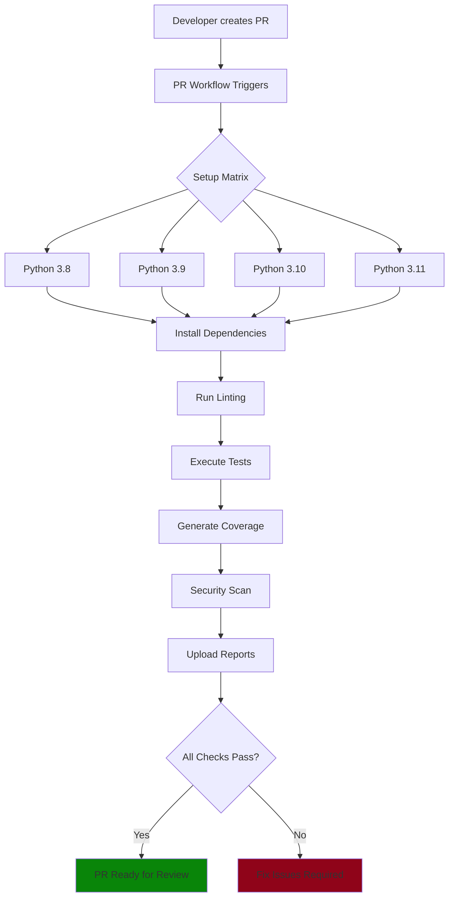
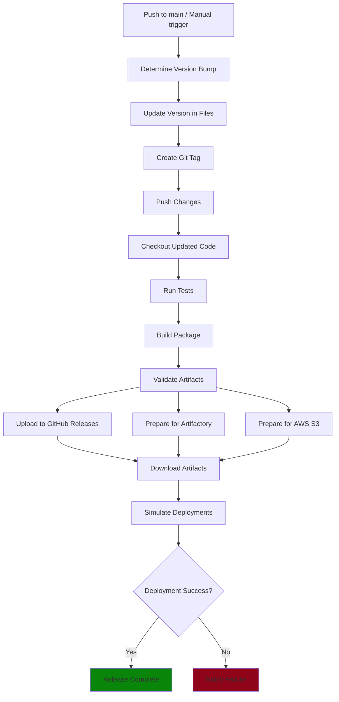

[](https://github.com/Matan-Shabi/msd-pipeline-hw/actions/workflows/pr.yml)
[](https://github.com/Matan-Shabi/msd-pipeline-hw/actions/workflows/release.yml)
[](LICENSE)

# MSD Pipeline Homework - CI/CD Implementation

A hands-on CI/CD pipeline built for a Python project using GitHub Actions. This isn’t just a demo — it’s meant to mirror real-world DevOps standards like automated testing, quality checks, and structured releases.


---

## Table of contents

- [Prerequisites](#prerequisites)  
- [Quick start](#quick-start)  
- [My approach](#my-approach)  
  - [Goals](#goals)  
  - [Design decisions](#design-decisions)  
- [Project overview](#project-overview)  
- [Repo structure](#repo-structure)  
- [Workflows](#workflows)  
  - [Pull request workflow](#pull-request-workflow)  
  - [Release workflow](#release-workflow)  
- [Troubleshooting](#troubleshooting)  

---


## Prerequisites

- Python 3.8–3.12  
- `pip install -r requirements.txt`  
- (Release) AWS credentials with write access to your S3 bucket  

---
## Quick start

```bash
git clone https://github.com/Matan-Shabi/msd-pipeline-hw.git
cd msd-pipeline-hw
pip install -r requirements.txt
# run tests locally
pytest --cov=main
# bump version, tag and build
bump2version patch && python -m build
```

## My Approach

### Why I Built It This Way

## Goals
Validate every pull request across supported Python versions

Automate version bump, tagging, packaging and artifact storage

Bake in linting, security scans, and coverage reporting

## Design decisions
Matrix testing on 3.8–3.12 for full compatibility

flake8, bandit, safety in PR checks to catch style and vulnerabilities early

bump2version for semantic versioning and automated git tags

GitHub Actions for CI/CD to leverage native integration and marketplace actions

## Project Overview

A subnet calculator CLI with GitHub Actions workflows:

* **PR Workflow** – runs tests, linting, and security scans on pull requests
* **Release Workflow** – bumps version, builds the package, and simulates deployment

## Repo Structure

```
msd-pipeline-hw/
├── .github/workflows/
│   ├── pr.yml
│   └── release.yml
├── main.py
├── test_main.py
├── setup.py
├── requirements.txt
└── README.md
```

## The App

This CLI lets you:

* Calculate subnet allocation per department
* Determine required subnet masks for given host counts

It’s useful for network planning and CIDR breakdowns.


## Why GitHub Actions?

* It’s already part of GitHub — no extra tools to manage
* Easy to learn, easy to share
* Lots of reusable actions in the marketplace

## Key Tools I Used

### Testing

* `unittest` — efficient and built-in
* `pytest + coverage` — for better test reporting
* Matrix testing — Python 3.8–3.12

### Quality & Security

* `flake8` — code style and bugs
* `bandit` — scans for security issues
* `safety` — checks for vulnerable dependencies

### Versioning

* `bump2version` — handles version bumps and tagging
* Semantic commits — for patch/minor/major logic

## Things I Ran Into

* **bump2version** failed on untracked files — solved it by handling version updates separately from git push
* **GITHUB\_TOKEN** didn’t allow pushing — fixed by explicitly setting permissions in the workflow
* **Publishing** — GitHub Package registry has strict naming rules, so I set it up but left it commented for now

## Workflows

## Pull Request Workflow



## Release Workflow



## How to Run It

### PR Workflow:

```bash
git checkout -b feature/my-feature
git commit -m "feat: new stuff"
git push origin feature/my-feature
# Open PR to main
```

### Release Workflow (Auto):

```bash
git checkout main
git pull
# Push your changes
# Workflow triggers automatically
```

### Release Workflow (Manual):

* Go to GitHub → Actions → Release → Run Workflow
* Choose patch/minor/major

## Local Dev

```bash
git clone <repo>
cd msd-pipeline-hw
pip install -r requirements.txt
pip install -e .
```

### Run tests:

```bash
python -m unittest
pytest --cov=main --cov-report=term-missing
```

### Lint & Scan:

```bash
flake8 .
bandit -r .
safety check
```

### Build package:

```bash
python -m build
```

## Troubleshooting
Q: bump2version fails on untracked files?
A: Commit your version file before running the bump.

Q: GITHUB_TOKEN can’t push tags?
A: Explicitly grant contents: write permissions in the workflow.

Q: GitHub Packages naming errors?
A: Follow <owner>/<repo> naming convention or comment out until you register the package name.

## Wrap-Up

This project shows how CI/CD can be clean, reliable, and team-friendly — even for small apps. It’s designed to scale and adapt to real team needs without the fluff.
