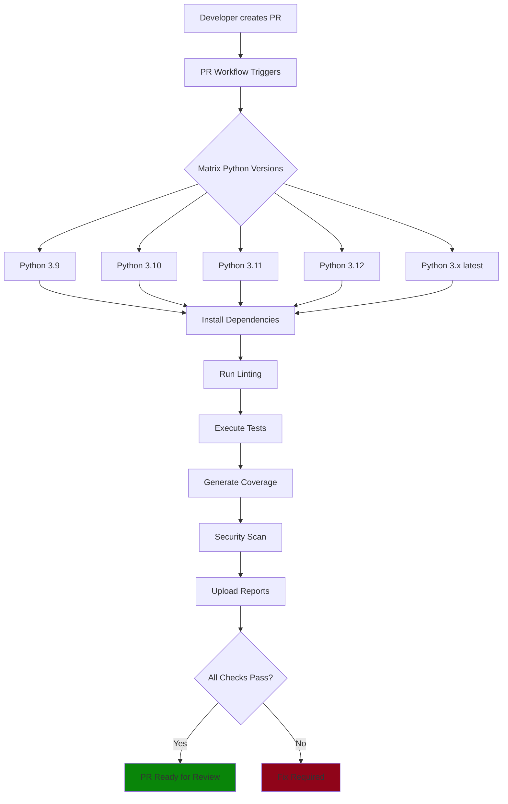
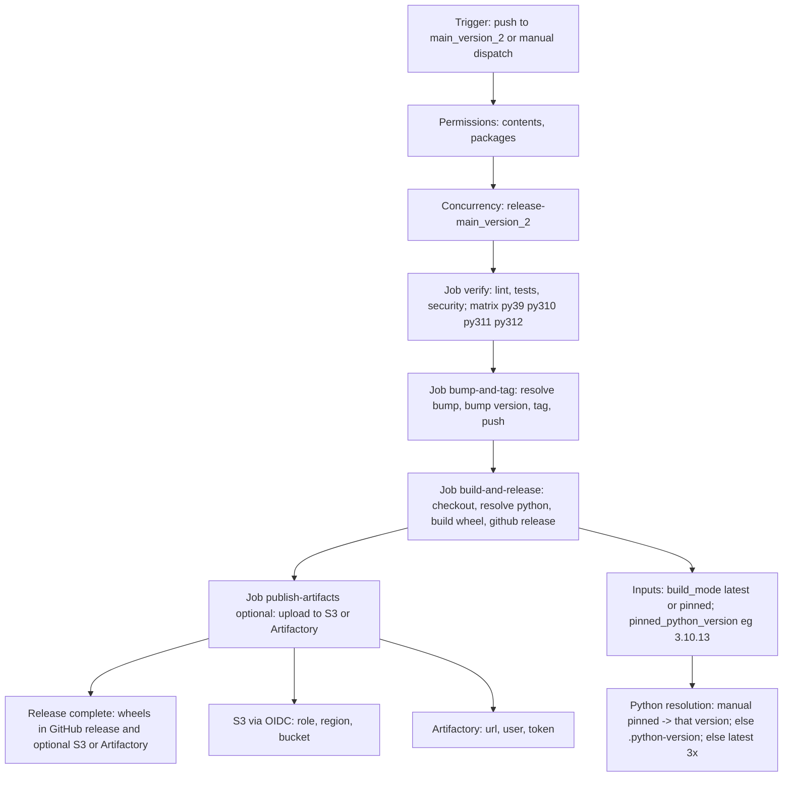

# MSD Pipeline Homework - CI/CD Implementation (main_version_2)

A hands-on CI/CD pipeline built for a Python project using GitHub Actions. This isn’t just a demo — it’s meant to mirror real-world DevOps standards like automated testing, quality checks, and structured releases.


## What's New in `main_version_2`
- **Quality gates in release** – Linting, testing, and security scans run before tagging a release.
- **Optional reproducible builds** – Run manually with a pinned Python version (`build_mode=pinned`).
- **Default artifact storage on GitHub Releases** – Optional publishing to S3 (OIDC) or Artifactory if secrets are set.
- **Dynamic Python setup** – Uses latest `3.x` by default, verified on Python 3.9–3.12.

## My Approach

### Why I Built It This Way

When I got the assignment, I didn’t want to just tick the boxes. I asked:

* How do engineering teams ensure subnet logic is accurate across scenarios?
* What makes a Python CLI tool testable and version-controlled?
* How can we guarantee safety and traceability from dev to deploy?

From there, I split the pipeline into two workflows:

* One for PRs: to test and validate changes before merging
* One for releases: to bump versions, tag, and package

### What I’d Want as a Team Lead

* Tests that run on all major Python versions
* Lint and security checks baked into every PR
* Clean, tagged releases with artifacts and traceable changes

## Project Overview

A subnet calculator CLI with GitHub Actions workflows:

* **PR Workflow** – runs tests, linting, and security scans on pull requests
* **Release Workflow** – bumps version, builds the package, and simulates deployment

## Repo Structure

```
msd-pipeline-hw/
├── .github/workflows/
│   ├── pr.yml
│   └── release.yml
├── main.py
├── test_main.py
├── setup.py
├── requirements.txt
└── README.md
```

## The App

This CLI lets you:

* Calculate subnet allocation per department
* Determine required subnet masks for given host counts

It’s useful for network planning and CIDR breakdowns.


## Why GitHub Actions?

* It’s already part of GitHub — no extra tools to manage
* Easy to learn, easy to share
* Lots of reusable actions in the marketplace

## Key Tools I Used

### Testing

* `unittest` — efficient and built-in
* `pytest + coverage` — for better test reporting
* Matrix testing — Python 3.8–3.12

### Quality & Security

* `flake8` — code style and bugs
* `bandit` — scans for security issues
* `safety` — checks for vulnerable dependencies

### Versioning

* `bump2version` — handles version bumps and tagging
* Automated **semantic version bump** (`patch` / `minor` / `major`) from commit messages or manual input.
* Git tag creation and push as part of release.

## Things I Ran Into

* **bump2version** failed on untracked files — solved it by handling version updates separately from git push
* **GITHUB\_TOKEN** didn’t allow pushing — fixed by explicitly setting permissions in the workflow
* **Publishing** — GitHub Package registry has strict naming rules, so I set it up but left it commented for now

## Pull Request Workflow



## How to Run It

### PR Workflow:

```bash
git checkout -b feature/my-feature
git commit -m "feat: new stuff"
git push origin feature/my-feature
# Open PR to main
```

### Release Workflow (Auto):



```bash
git checkout main
git pull
# Push your changes
# Workflow triggers automatically
```

### Release Workflow (Manual):

* Go to GitHub → Actions → Release → Run Workflow
* Choose patch/minor/major

## Local Dev

```bash
git clone <repo>
cd msd-pipeline-hw
pip install -r requirements.txt
pip install -e .
```

### Run tests:

```bash
python -m unittest
pytest --cov=main --cov-report=term-missing
```

### Lint & Scan:

```bash
flake8 .
bandit -r .
safety check
```

### Build package:

```bash
python -m build
```

## Wrap-Up

This project shows how CI/CD can be clean, reliable, and team-friendly — even for small apps. It’s designed to scale and adapt to real team needs without the fluff.
